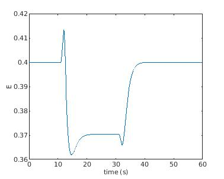

# Balloon Model Simulator

## Synopsis
Simulate the haemodynamic response to brain activation, in 
[MATLAB](www.mathworks.com) using the Balloon Model as described in Buxton 
et. al. 1998 and 2004 

## Demonstration
We can simulate the haemodynamic response to brain activation, in 
[MATLAB](www.mathworks.com) using the Balloon Model as
shown in the [MATLAB demo](./demo.m) and described below:

1. Generate a stimulus (s):
    ```matlab
    % Generate a time vector
    t_start = 0;
    t_end = 60;
    t_step = 0.1;
    t = t_start : t_step : t_end;
    
    % Define the stimulus
    s=zeros(1, length(t));
    stimulus_start = 10;
    stimulus_end = 30;
    s(stimulus_start / t_step: stimulus_end / t_step) = 1;
    
    figure(1);
    plot(t, s);
    ylim([-0.5 2]);
    xlim([t_start t_end]);
    xlabel('time (s)');
    ylabel('s(t)')
    ```
    

2. Model the neural response (N):
    ```matlab
    % Neural Response parameters
    kappa = 3;      % Inhibitory gain factor 
    tau_i = 3;      % Inhibitory time constant
    
    N = neural_response(kappa, tau_i, t_step, s);
    
    figure(2);
    plot(t, N);
    ylim([-0.5 2]);
    xlim([t_start t_end]);
    xlabel('time (s)');
    ylabel('N(t)')
    ```
    

3. Calculate CBF (f) and CMRO2 (m) from the neural response:
    ```matlab
    % Neuro-vascular coupling parameters
    tau_f = 4;      % Width of CBF impulse response
    tau_m = 4;      % Width of CMRO2 impulse response
    delta_tf = 2;   % Delay of CBF response to model lag of hemodynamic response
    delta_tm = 1;   % Delay of CMRO2 response to model lag of hemodynamic response
    f_1 = 1.5;      % Response shape scaling
    n = 3;          % Steady state flow-metabolism relation in eqn.3 n=f-1/m-1
    
    [f, m] = cbf_cmro2(tau_f, tau_m, delta_tf, delta_tm, f_1, n, t_step, t_end, t, N);
    
    figure(3);
    plot(t, f, t, m)
    legend('f', 'm');
    xlabel('time (s)');
    ```
   

4. Calculate the oxygen extraction fraction (E) from CMRO2 and CBF: 
    ```matlab
    E_0 = 0.4;      % Baseline oxygen extraction fraction
    
    E = oef(E_0, m, f);
    
    figure(4);
    plot(t, E);
    xlabel('time (s)');
    ylabel('E');
    ```
    


5. Calculate CBV (v) and deoxyhaemoglobin content (q) using the balloon model: 
    ```matlab
    % Ballon Model parameters
    alpha = 0.4;    % Steady state flow-volume relation in eqn.1 v=f^alpha
    tau_mtt = 3;    % Transit time through the balloon
    tau = 20;       % Viscoelastic time constant
    
    [v, q] = balloon_response(alpha, tau_mtt, tau, t_step, f, m);
    
    figure(5);
    plot(t, v, t, q);
    legend('v', 'q');
    xlabel('time (s)');
    ```
    
    
6. Calculate the BOLD signal (b):
    ```matlab
    % BOLD signal parameters
    V_0 = 0.03;     % Baseline blood volume
    a_1 = 3.4;      % Weight for deoxyHb change
    a_2 = 1;        % Weight for CBV change
    
    b = bold(V_0, a_1, a_2, q, v);
    
    figure(6);
    plot(t, b);
    xlabel('time (s)');
    ylabel('b (%)');
    ```
    
  

## References
1. [Buxton et al. _Dynamics of blood flow and oxygenation changes during
brain activation_ Magnetic Resonance in Medicine 39:855-864 (1998)](./Dynamics_of_blood_flow_and_oxygenation_changes_during_brain_activation_Buxton_1998.pdf)

2. [Buxton et al. _Modeling the hemodynamic response to brain activation_ 
NeuroImage 23 (2004) S220 – S233](./Modeling_the_hemodynamic_response_to_brain_activation_Buxton_2004.pdf) 


## License
See [MIT license](./LICENSE)

## Author
Written by [Dr Stephen Wastling](mailto:stephen.wastling@nhs.net).
